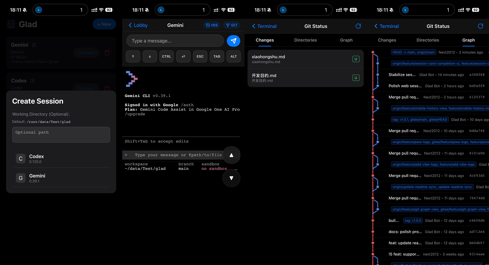
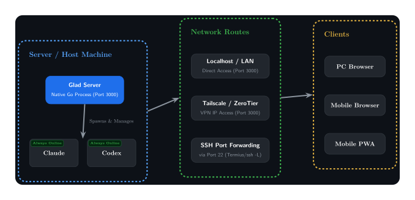

<div align="center">
  
  <h1>Glad</h1>
</div>

Glad is a local-first Web interface for terminal-based AI coding tools.

It lets you run interactive CLI tools such as **Claude Code**, **Aider**, **GitHub Copilot CLI**, and **Gemini CLI** on your machine, then access them through a clean browser UI from desktop or mobile devices on your local network.



### Demo Video

Watch how Glad brings terminal AI tools to your mobile device seamlessly:

<video src="assets/Demo.mp4" controls width="100%"></video>

> [!NOTE]
> Glad is derived from [termly-cli](https://github.com/termly-dev/termly-cli), but the current project is intentionally focused on a simpler model: local execution, local network access, and a lightweight Web UI for terminal-native AI tools.

## How it works



Glad's core working principle:
1. Glad runs on your server or local machine where Claude, Codex, Aider, and other CLI tools are installed.
2. Once started, Glad is accessible on your local machine and LAN via port 3000.
3. If you use Tailscale or ZeroTier for intranet penetration, you can control it remotely from anywhere.
4. All terminal tasks run locally within the Glad daemon, so your mobile device disconnecting won't affect task execution.

## Design Philosophy & Highlights

Glad was created to enable **vibe coding** on mobile devices. By bringing various CLIs to the web browser, login and authorization are completely aligned with the official tools, ensuring you can fully utilize your paid monthly subscriptions anywhere.

Our design philosophy is **Easy to use, Stable, and Restrained**. Glad focuses strictly on the essentials:
- **Session management:** Run multiple sessions from a single dashboard with per-session working directories.
- **High-fidelity terminal interaction:** A mobile-friendly terminal experience with touch shortcuts.
- **Extreme performance history viewing:** Fast and responsive text history.
- **Simple but effective change checking:** Integrated Git changes preview.
- **Resilient execution:** Client (mobile) disconnections will not interrupt running tasks on the host machine.
- **Simplicity:** One-command Web UI with built-in detection for many popular AI CLIs.
- **Standalone binaries:** Linux, macOS, and Windows standalone packaging available.

## Quick Start

### Run from source

Requirements:

- Node.js `>=18`

```bash
git clone git@gitee.com:anonymous/glad.git
cd glad
npm install
node bin/cli.js
```

### Run as a binary

**Linux:**

```bash
chmod +x glad-linux-amd64
./glad-linux-amd64
```

**Windows:**

Simply double-click `glad-windows-amd64.exe` to run, or execute it in the Command Prompt:

```cmd
glad-windows-amd64.exe
```

**macOS Intel:**

```bash
chmod +x glad-macos-x64
./glad-macos-x64
```

**macOS Apple Silicon:**

```bash
chmod +x glad-macos-arm64
./glad-macos-arm64
```

## Usage

Glad starts a local Web server on port `3000` by default.

1. Open `http://localhost:3000`.
2. Click `+ New`.
3. Optionally choose a working directory.
4. Pick an installed AI tool.
5. Start the session from the browser UI.

Useful commands:

```bash
glad
glad /path/to/project
glad . --port 8080
glad tools list
glad tools detect
```

## Supported Tools

Glad currently auto-detects the 20 terminal AI tools defined in the code registry. The names below are the registry `displayName` values used by Glad:

| Tool | Detected command |
| --- | --- |
| Claude | `claude` |
| Aider | `aider` |
| Codex | `codex` |
| Copilot | `copilot` |
| Cody | `cody chat` |
| Gemini | `gemini` |
| Continue | `cn` |
| Cursor | `cursor-agent` |
| ChatGPT | `chatgpt` |
| ShellGPT | `sgpt --repl temp` |
| Mentat | `mentat` |
| Grok | `grok` |
| Ollama | `ollama run codellama` |
| OpenHands | `openhands` |
| OpenCode | `opencode` |
| Blackbox AI | `blackboxai` |
| Amazon Q | `q` |
| Pi | `pi` |
| Kilo | `kilo` |
| Qoder | `qodercli` |

Glad also includes a built-in `demo` tool for testing, but demo mode is not included in auto-detection.

## Packaging

Build a Linux standalone binary with:

```bash
npm run build:linux
```

Build a Windows standalone binary with:

```bash
npm run build:windows
```

Build a macOS Intel standalone binary on an Intel macOS runner with:

```bash
npm run build:macos:x64
```

Build a macOS Apple Silicon standalone binary on an Apple Silicon macOS runner with:

```bash
npm run build:macos:arm64
```

After building, `glad-linux-amd64`, `glad-windows-amd64.exe`, `glad-macos-x64`, and `glad-macos-arm64` files will be generated respectively. The GitHub release workflow builds macOS Intel on `macos-15-intel` and macOS Apple Silicon on `macos-14`.

## Security Model

Glad is designed for trusted local or private-network use.

- the server runs on your machine
- terminal I/O stays local to that machine
- the browser UI talks directly to the local Glad process

Do not expose Glad directly to the public internet without adding your own access controls.

See [SECURITY.md](./SECURITY.md) for details.


## License

MIT. Glad is maintained by [anonymous](https://gitee.com/anonymous/glad).
