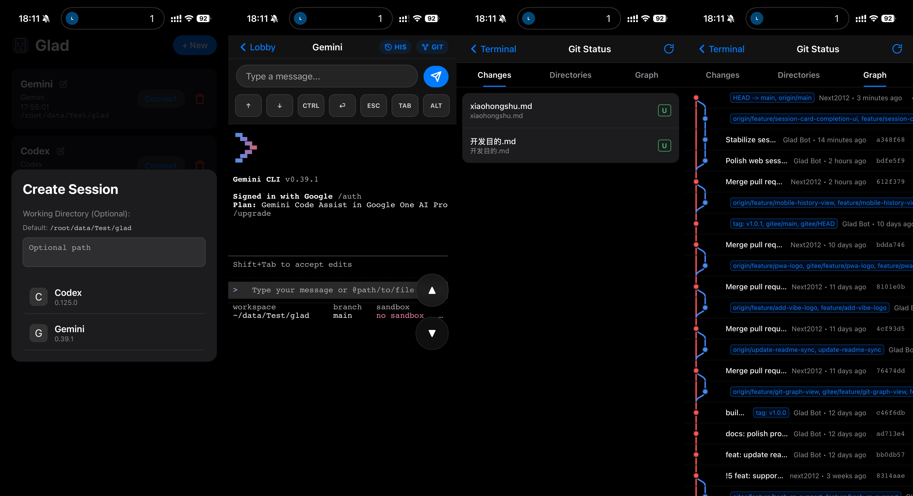
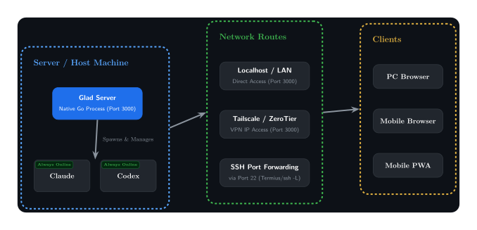

<div align="center">
  
  <h1>Glad</h1>
</div>

Glad is a local-first Web interface for terminal-based AI coding tools.

It runs the official **Claude Code** and **Codex** CLIs on your machine, then exposes their structured sessions through a clean browser UI on desktop or mobile devices.



### Demo Video

Watch how Glad brings terminal AI tools to your mobile device seamlessly:

<video src="assets/Demo.mp4" controls width="100%"></video>

> [!NOTE]
> Glad is derived from [termly-cli](https://github.com/termly-dev/termly-cli), but the current project is intentionally focused on a simpler model: local execution, local network access, and a lightweight Web UI for terminal-native AI tools.

## How it works



Glad's core working principle:
1. Glad runs on the machine where the official Claude and/or Codex CLI is installed.
2. Once started, Glad is accessible on your local machine and LAN via port 3000 (or a port selected with `--port`).
3. If you use Tailscale or ZeroTier for intranet penetration, you can control it remotely from anywhere.
4. All terminal tasks run locally within the Glad daemon, so your mobile device disconnecting won't affect task execution.

## Design Philosophy & Highlights

Glad was created to enable **vibe coding** on mobile devices. By bringing various CLIs to the web browser, login and authorization are completely aligned with the official tools, ensuring you can fully utilize your paid monthly subscriptions anywhere.

Our design philosophy is **Easy to use, Stable, and Restrained**. Glad focuses strictly on the essentials:

- **Session management:** Run multiple sessions from a single dashboard with per-session working directories.
- **Multi-session group chat:** Start an empty group, add live Codex and Claude sessions, explicitly @mention targets, and quote selected messages. Resume saved group history into the current group or Fork an independent copy. Groups support live updates, Stop/recovery cancellation, scheduled messages, completion indicators, and desktop tiles without drag reordering; provider histories and attachments remain owned by the member sessions.
- **Group supervision:** Use the group Supervisor panel to schedule a session to inspect and direct selected members through Glad MCP tools. Choose read/stop/send permissions per target, and set the delay after the **supervisor's own check completes**. Pause recurring monitoring, run a single check, or stop the current run independently. Read live output, stop, and send commands manually from Members → Controls. [Supervisor guide](docs/supervisors.md).
- **Message references:** Hold a group message to enter selection mode, tap messages to toggle references, and use Cancel or Preview at the top. Other group members may keep running while you send to idle targets.
- **Session ordering:** Hold a lobby card for three seconds to drag it, with automatic edge scrolling for long lists. Drag a tiled session's header to reorder its current page. Both views share the order, saved as a browser-local layout preference.
- **Responsive workspace:** Use a resizable session sidebar or a live tiled multi-session dashboard on wide screens, and focused lobby/chat pages on mobile, with light and dark themes.
- **Diagrams and formulas:** Render Mermaid code blocks and inline/display LaTeX in Codex and Claude conversations, including restored messages and tiled previews. Mermaid, KaTeX, and fonts are bundled locally; diagrams follow the theme and keep their source available.
- **Markdown formatting:** Nested lists, task checkboxes, strikethrough, aligned tables, reference links, automatic URL/email links, and full heading levels. Relative file and image links resolve inside the conversation's working directory.
- **File attachments:** Upload images or arbitrary local files from the composer; Glad stores them privately for the active session and cleans them up automatically.
- **Local usage dashboard:** Select a week or month, compare per-model and daily token totals, and inspect model-stacked token and cost charts through the bundled read-only `ccusage` engine. Costs use `ccusage` estimates and are shown only for GPT models used by Codex.
- **Structured provider sessions:** Native streaming, approvals, resume, fork, model, effort, sandbox, and context controls for Codex and Claude. Codex model, effort, and permission choices persist as Glad defaults for new sessions, with a separate explicit action to update Codex's global defaults. Supported Codex models offer a Fast switch that applies to the next turn; new Glad sessions start with Fast off.
- **Grouped session list:** Sessions belonging to live groups appear in a collapsed section at the bottom of the Sessions list. Expand a group to connect to its sessions. Shared sessions appear under each group, and sessions return to the main list when they leave their last live group.
- **Codex question replies:** Answer pending questions in cards or a bottom reply panel on phones. Async replies can include up to five images and remain available after the turn completes until a new turn starts.
- **Codex capacity recovery:** When the main task fails because the model is overloaded, Glad sends `继续` in the same conversation after 30 seconds, with up to five automatic retries. Stop cancels a pending retry. Intermediate failures do not trigger completion notifications; success or final failure does.
- **Claude structured workflows:** Answer Claude questions in dedicated cards, follow Todo/Task progress and subagents, inspect combined usage and context status, compact context, and launch prompts, skills, or commands from the shared action rail.
- **Claude history browsing:** Sort and paginate current-directory Claude sessions, preview recent messages, then explicitly resume or fork the selected conversation.
- **Codex history browsing:** Sort current-directory history by creation or update time, load older sessions, and preview recent messages before explicitly resuming or forking.
- **Codex task lists:** Glad enables the planning tool for its Codex conversation threads. When Codex creates a plan, a collapsible floating card tracks its progress; after the turn ends, the card appears between the user's message and the first reply. Resuming or forking a conversation restores recoverable plans from its local Codex rollout log. Missing records and plans with dynamically computed arguments that cannot be parsed statically are skipped.
- **Automatic Codex titles:** Generate short titles through isolated temporary turns using the existing Codex provider, while preserving manual names. Title generation may consume additional model usage; failures do not block the conversation.
- **Fast history viewing:** Responsive structured conversation history with lazy tool details.
- **Simple but effective change checking:** Integrated Git changes preview.
- **Resilient execution:** Client (mobile) disconnections will not interrupt running tasks on the host machine.
- **Simplicity:** One-command Web UI with built-in detection for Codex and Claude.
- **Standalone binaries:** Linux, macOS, and Windows standalone packaging available.

## Quick Start

### Install with npm

Requirements:

- Node.js `>=18` for npm installation
- the official `codex` and/or `claude` CLI, already authenticated

```bash
npm install -g glad-web
glad
```

After installation, the package name is `glad-web` and the command is `glad`.

### Run from source

Requirements:

- Go `>=1.24`
- Node.js `>=18` for frontend tests and release packaging

```bash
git clone https://github.com/Next2012/Glad.git
cd glad
npm ci
go run .
```

### Run as a binary

**Linux:**

```bash
chmod +x glad-linux-amd64
./glad-linux-amd64
```

**Windows:**

Simply double-click `glad-windows-amd64.exe` to run, or execute it in the Command Prompt:

```cmd
glad-windows-amd64.exe
```

**macOS Intel:**

```bash
chmod +x glad-macos-x64
./glad-macos-x64
```

**macOS Apple Silicon:**

```bash
chmod +x glad-macos-arm64
./glad-macos-arm64
```

## Usage

Glad starts a local Web server on port `3000` by default.

1. Open `http://localhost:3000`.
2. Click `+ New`.
3. Optionally choose a working directory.
4. Pick an installed AI tool.
5. Start the session from the browser UI.

Useful commands:

```bash
glad
glad /path/to/project
glad . --port 8080
glad tools list
glad tools detect
```

### Connect to an agent workbench

Open **Settings → AgentWorkbench** to see this Glad installation's stable ID,
edit its alias, and add workbenches. Enter the workbench WSS address and token.
No CA upload or working-directory setup is needed. Workbench sessions get their
own local directories automatically.
Each workbench appears as a card with its own auto-connect switch and delete button.
The connected workbench's ID and alias are synchronized on the card.

To open MCP resource links returned in chat, expand **MCP resource access** on
the connection card and configure the same Hub URL and local token file used by
that assistant. Turn that target off before saving, then turn it on again; its
paired identity is retained. Browser downloads use that configured identity and
show an error if it lacks access, without exposing the token.
Integrated AI launchers explicitly pass their existing MCP route to ordinary
Glad pages as well. Each WSS target continues using its own configuration.

The first connection shows **Waiting for trust**. In the workbench's
**AI助理连接** page, choose **信任** for that Glad. Session operations are enabled
only after approval. Trust persists across restarts and can be revoked in the
workbench. Glad authenticates the workbench with the connection token and binds
the proof to the TLS certificate and fresh challenges before sending its scoped
identity key. A changed certificate requires deleting and pairing the target again.

The switch is saved. Starting Glad attempts each enabled workbench once; a failed
or closed connection stays disconnected until you explicitly connect again.
Turning the switch off saves that choice for subsequent starts. Settings use
`~/.glad/agent-workbench.json`, which can be supplied before starting Glad:

```json
{
  "gladId": "2c9b8335-5c7d-4a91-850c-cd827cd2a105",
  "alias": "Development Glad",
  "workbenches": [
    {
      "url": "wss://workbench.example.com:8443/api/assistant-connections/ws",
      "token": "REPLACE_WITH_A_RANDOM_TOKEN_AT_LEAST_32_CHARACTERS",
      "autoConnect": true
    }
  ]
}
```

Omit `gladId` to generate a new installation ID. Keep the file private (`0600`)
and preserve it across restarts. Optional `caCertificate` contains the private CA
PEM for legacy CLI use; GUI connections use pairing. `workingDirectory` is retained
only to restore pre-existing sessions. Optional `mcpUrl` and
`mcpTokenFile` select the CLI MCPHub for that connection.
All other Glad sessions keep their existing MCP configuration.

Workbench session directories are kept when stopped or disconnected, and are
cleaned when the workbench session is deleted. Offline deletions are reconciled
on a later trusted connection. Existing project directories remain outside
automatic cleanup.

Claude finishes each reply without requesting `/context` automatically. Use the
Status button to read statistics; ordinary reply token usage, cost and duration
remain available.

Settings use a navigation panel on desktop and a list of configuration cards on
mobile. Claude's default permission mode is `auto`; users can select another mode.
Workbench conversations use the same session controls as Glad, including permissions,
approval actions, native history, resume, fork and scheduled inputs.

Glad can initiate an authenticated WSS connection to a workbench:

```bash
glad connect \
  --url wss://workbench.example.com:8443/api/assistant-connections/ws \
  --token-file /private/workbench-client.token \
  --name 'Development Glad' \
  --directory /workspace/project
```

Use `--ca-file /private/workbench-ca.pem` for a private certificate authority.
This mode has no listening port and makes one connection attempt. Ctrl+C closes
its sessions and exits; reconnecting requires running the command again.
The workbench can use Codex or Claude through this connection. Session creation
uses the local directory and Glad's session defaults; Claude defaults to `auto`.
Permissions and other session controls can be changed in the workbench.
Connection history is scoped to the workbench, client identity, and
directory, and stored under the user's `glad-workbench` configuration directory.
Keep it and the native CLI history to resume conversations after reconnecting.

For the BotLink STDIO MCP client, `--mcp-url` and `--mcp-token-file` together select
the Hub used by CLI processes started through this connection. Other Glad
processes keep their own configuration.

When Codex starts this helper as a STDIO MCP server, add
`env_vars = ["GLAD_WORKBENCH_MCP_URL", "GLAD_WORKBENCH_MCP_TOKEN_FILE"]`
to that server's `config.toml` entry so the helper receives the selected route.

## Supported Tools

Glad intentionally supports the two structured coding-agent integrations below:

| Tool | Detected command |
| --- | --- |
| Claude | `claude` |
| Codex | `codex` |

## Packaging

Build a Linux standalone binary with:

```bash
npm run build:linux
```

Build a Windows standalone binary with:

```bash
npm run build:windows
```

Build a macOS Intel standalone binary on an Intel macOS runner with:

```bash
npm run build:macos:x64
```

Build a macOS Apple Silicon standalone binary on an Apple Silicon macOS runner with:

```bash
npm run build:macos:arm64
```

The Go release pipeline cross-builds stripped, standalone binaries for Linux x64/arm64, Windows x64, and macOS x64/arm64. npm publishes a small launcher plus one OS/CPU-specific binary package, so installations do not contain the Go backend source.

Developer references:

- [Architecture](docs/architecture.md)
- [Development and testing](docs/development.md)
- [Release process](docs/releasing.md)

## Security Model

Glad is designed for trusted local or private-network use.

- the server runs on your machine
- terminal I/O stays local to that machine
- the browser UI talks directly to the local Glad process
- SkillHub API tokens are encrypted with a private key generated automatically in `~/.glad` unless an external key file is configured

Do not expose Glad directly to the public internet without adding your own access controls.

See [SECURITY.md](./SECURITY.md) for details.


## License

MIT. Glad is maintained by [Next2012](https://github.com/Next2012/Glad).
