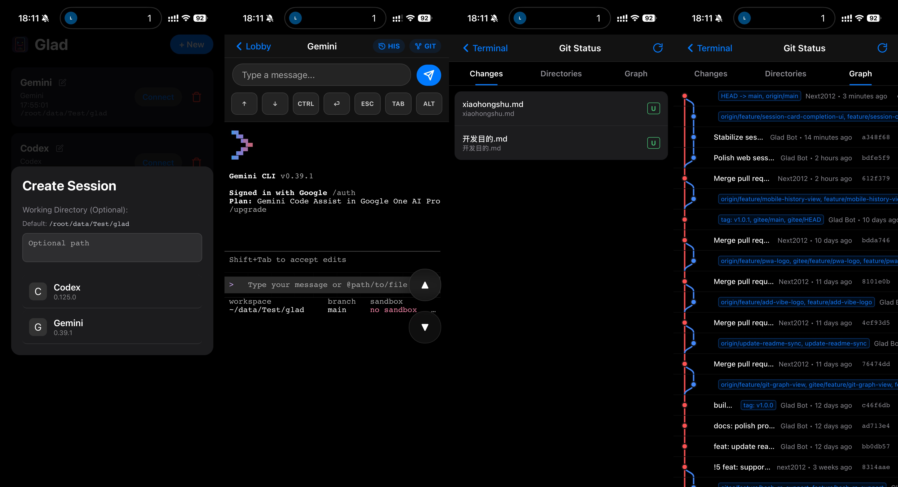

<div align="center">
  
  <h1>Glad</h1>
</div>

Glad 是一个面向终端 AI 编码工具的本地优先 Web 界面。

它让你可以在自己的机器上运行 **Claude Code**、**Aider**、**GitHub Copilot CLI**、**Gemini CLI** 等交互式命令行工具，并通过一个适合桌面和移动端访问的浏览器界面来使用它们。



### 演示视频

看看 Glad 如何将终端 AI 工具无缝带到你的移动设备上：

<video src="assets/Demo.mp4" controls width="100%"></video>

> [!NOTE]
> Glad 基于 [termly-cli](https://github.com/termly-dev/termly-cli) 演化而来，但当前项目已经明确收敛为更简单的模型：本地执行、局域网访问、以及围绕终端 AI 工具的轻量 Web UI。

## 开发目的与设计哲学

Glad 的初衷是开发一款完全运行在本地的、足够简单的，且登录和授权完全对齐官方的工具，可以把各种 CLI “搬”到网页端。这样你就可以在移动设备上随时进行 **vibe coding**，不用担心包月订阅闲置，也无需担心客户端手机断联会导致电脑端的任务停止。

我们的设计哲学是：**易用、稳定、克制**。只提供最核心且体验优秀的功能：
- **Session 管理**：在一个面板中管理多个会话，每个会话可单独指定工作目录。
- **高还原度的 terminal 交互**：专为手机优化的终端体验与快捷按键。
- **极致性能的历史查看**：快速流畅的终端历史记录浏览。
- **简单但足够好用的改动检查**：内置 Git 改动预览功能。
- **断线保护**：服务端任务不受移动端网络断开影响。
- **开箱即用**：一条命令启动 Web UI，自动检测多种主流 AI CLI。
- **独立二进制**：支持打包 Linux 和 Windows 独立可执行文件。

## 快速开始

### 从源码运行

要求：

- Node.js `>=18`

```bash
git clone git@gitee.com:next2012/glad.git
cd glad
npm install
node bin/cli.js
```

### 以二进制运行

**Linux:**

```bash
chmod +x glad-linux-amd64
./glad-linux-amd64
```

**Windows:**

直接双击 `glad-windows-amd64.exe` 即可运行，或者在命令提示符中执行：

```cmd
glad-windows-amd64.exe
```

## 使用方式

Glad 默认在本机 `3000` 端口启动 Web 服务。

1. 打开 `http://localhost:3000`
2. 点击 `+ New`
3. 按需填写工作目录
4. 选择一个已安装的 AI 工具
5. 在浏览器里启动并使用会话

常用命令：

```bash
glad
glad /path/to/project
glad . --port 8080
glad tools list
glad tools detect
```

## 支持的工具

Glad 当前会自动检测代码注册表中定义的 20 个终端 AI 工具。下面的名称严格使用 Glad 注册表里的 `displayName`：

| 工具 | 检测命令 |
| --- | --- |
| Claude | `claude` |
| Aider | `aider` |
| Codex | `codex` |
| Copilot | `copilot` |
| Cody | `cody chat` |
| Gemini | `gemini` |
| Continue | `cn` |
| Cursor | `cursor-agent` |
| ChatGPT | `chatgpt` |
| ShellGPT | `sgpt --repl temp` |
| Mentat | `mentat` |
| Grok | `grok` |
| Ollama | `ollama run codellama` |
| OpenHands | `openhands` |
| OpenCode | `opencode` |
| Blackbox AI | `blackboxai` |
| Amazon Q | `q` |
| Pi | `pi` |
| Kilo | `kilo` |
| Qoder | `qodercli` |

Glad 还内置了用于测试的 `demo` 工具，但 demo 模式不计入自动检测列表。

## 打包

构建 Linux 独立二进制：

```bash
npm run build:linux
```

构建 Windows 独立二进制：

```bash
npm run build:windows
```

构建后会分别生成 `glad-linux-amd64` 和 `glad-windows-amd64.exe` 文件。

## 安全模型

Glad 面向受信任的本机或局域网环境使用。

- 服务进程运行在你的机器上
- 终端 I/O 保留在本机
- 浏览器 UI 直接与本地 Glad 进程通信

如果没有额外访问控制，不建议直接暴露到公网。

更多说明见 [SECURITY.md](./SECURITY.md)。


## 开源协议

本项目使用 MIT 协议，由 [next2012](https://gitee.com/next2012/glad) 维护。
