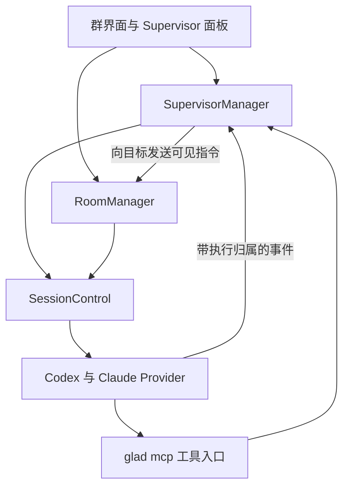

# 群聊 Supervisor 与消息多选评估

评估日期：2026 年 10 月 4 日。

两项需求均可在现有群聊架构上实现。Supervisor 建议增加统一 Session 控制和按群配置的定时调度器；消息多选建议采用长按进入、整条点击勾选、顶部预览的交互。两项功能可以分开交付，多选无需等待 Supervisor。

本文依据当前代码整理现状与建议，不代表功能已经实现。涉及 MCP 接入的兼容性需要实际验证；本轮只新增评估文档，不修改功能代码，也不执行功能测试。

## 一 Supervisor 需求与实现边界

### 用户需求

1. 群内其他成员运行时，仍可向空闲 Session 发消息。
2. 运行中的 Session 也能实时读取当前输出和历史会话。
3. 支持停止指定 Session，并向已停止且可接收输入的 Session 发送提示词启动下一轮；界面提供对应按钮。
4. 底栏增加 Supervisor 按钮，配置执行者、监控对象及三种权限、结束后的触发间隔、每次触发的提示词。
5. 展示任务状态、调用历史，并支持编辑已创建任务。

这里的“发送命令”指给 AI Session 发送提示词，延续当前会话。Supervisor 根据提示词决定操作，Glad 负责调用约束、调度和审计，不额外管理开发计划或验收流程。

### 当前代码已经具备的能力

| 能力 | 当前实现 | 需要补充 |
| --- | --- | --- |
| 读取 Session | `GET /api/sessions/{id}` 返回状态与消息快照，WebSocket 推送事件 | 面向监控的增量读取、分页历史、长度限制 |
| 发送提示词 | `/api/sessions/{id}/input`、WebSocket 输入、群消息 dispatch | 统一忙碌判断、幂等和执行归属 |
| 停止 Session | Codex 与 Claude abort 路由调用 `InterruptProvider` | 统一入口、停止进度、后续可发送条件 |
| 定时调度 | Session 与群 timed-input，群计时器使用 revision 淘汰旧回调 | 结束后延迟、执行者忙碌时等待、重复触发合并 |
| 轮次事件 | `turn-start`、`turn-end`、状态变化 | 一次 supervisor 调用跨重试的稳定关联 |
| 群展示 | 合并群记录和成员原生历史 | 控制轮次过滤、Supervisor 命令来源展示 |

代码依据：[server.go](../internal/app/server.go)、[provider_routes.go](../internal/app/provider_routes.go)、[room_timed_inputs.go](../internal/app/room_timed_inputs.go)、[room_runtime.go](../internal/app/room_runtime.go)。

### 建议分层

`SessionControl` 统一读取、停止、发送和可发送判断。所有发送入口都接入该层，包括 HTTP、WebSocket、群消息和定时消息。Provider 的内部自动重试继续由 Provider 管理，但必须继承原执行的归属。

`SupervisorManager` 保存配置、调度触发、校验工具调用和记录审计。执行者判断是否停止目标或发送下一步命令，不要求输出固定的开发计划格式。

`glad mcp` 作为执行者的结构化工具入口，经 daemon 调用上述能力。MCP 接入验证不通过时，可换成本地 CLI 入口，调度和 Session 控制分层保持一致。

### 群发送与停止规则

发送按被选中的目标检查，其他成员运行不影响本次发送。空闲必须同时满足 Session 存在、当前执行已结算、没有发送预占、没有停止或恢复操作；不能只检查公开的 `StatusValue`。

建议多目标发送在保存群消息和上传附件前先检查全部目标。任一目标已知不可接收时，拒绝发送并保留草稿，不自动去掉目标。发送前预检和实际调用之间仍可能出现状态变化，因此后端需要在发送入口内同步检查并预占；provider 返回的部分失败要逐项展示，不承诺跨 provider 原子提交。

当前 Codex 会拒绝忙碌时发送，Claude `Send` 没有对应的普通轮次忙碌检查。放开群发送不能只修改前端，否则可能向运行中的 Claude 插入一轮。

停止只中断当前执行，不删除 Session 或历史。接口可带预期 turn ID 和执行版本防止旧请求误停，但当前 `Interrupt(ctx)` 没有指定 turn 参数，接口层比较并不构成严格的 provider 原子保证。

“请求停止已接受”与“已可发送”需要分开显示。尤其 Claude `Interrupt` 会提前设置 idle，内部旧轮次仍可能未结算。界面应显示停止中，确认停止完成或 provider 已完成清理恢复后再启用启动按钮。

代码依据：[rooms.go](../internal/app/rooms.go) 的 `PostMessage` 与 `dispatch`，[claude.go](../internal/app/claude.go) 的 `Send` 与 `Interrupt`，[codex.go](../internal/app/codex.go) 的 `Send` 与 `Interrupt`。

### 读取接口与执行归属

建议读取结果包含状态、原生会话 ID、当前执行及 turn ID、当前文字、工具摘要、游标和截断标志。历史按该目标的当前会话分页读取；不默认遍历该 provider 的其他会话。大段工具结果按需读取。

增量游标应基于会话级变更 revision，而不是消息数组下标或只在新增时分配的序号。当前流式输出会通过 `patchMessage` 更新原有消息；删除消息和加载原生历史又会重置列表。

- 新增、内容更新和状态变化都推进 revision；消息 ID 保持稳定。
- 返回游标之后变化的消息当前内容，读取者按 ID 更新，避免重复追加。
- 删除、整体替换历史或游标过旧时，返回 `reset: true` 和新的有限快照。
- reset 后保留单调递增 revision，或通过明确的 generation 区分旧游标。
- 不必保存每个流式碎片；返回内容需明确截断范围和继续读取方式。

一次 supervisor 触发建议拥有稳定的 `invocationId`，其下包含实际尝试的 `clientMessageId`、原生会话 ID 和 turn ID。来源至少区分人工消息、supervisor 触发和 supervisor 向目标发送的命令。

当前容量重试并非使用同一份输入和同一个消息 ID：[codex_capacity_retry.go](../internal/app/codex_capacity_retry.go) 的 `runCapacityRetry` 使用 `newUUID()` 发送“继续”。因此不能仅靠首次 `clientMessageId` 调用 `sessionTurnLocator` 等待全部尝试结束。重试需继承 invocation；取消重试、重试启动失败和最终结束都应结算同一次调用。

代码依据：[sessions.go](../internal/app/sessions.go) 的 `patchMessage`、`removeMessagesByClientMessageID`、`replaceMessages` 与 `replaceClaudeConversation`。

### 定时和异常处理

表单四栏按用户需求保留。监控对象可以多选，每个对象分别提供读取、停止、发送三个开关，默认全开。建议第一版禁止监控自己，也禁止执行者成为其他 Supervisor 的控制目标。

触发采用结束后延迟：本次调用执行完后再等待配置间隔，不使用固定周期堆积待执行任务。同一执行者全局串行处理 supervisor 触发；到期时被人工消息占用，只保留一次待触发，显示等待执行者。

| 状态 | 含义 |
| --- | --- |
| paused | 暂停自动触发 |
| scheduled | 等待 nextAt |
| waiting_executor | 已到期，执行者暂不可接收 |
| running | 本次 invocation 正在执行或自动重试 |
| needs_attention | 需要审批、回答或处理不确定状态 |
| failed | 本次调用明确失败，显示原因 |

计时器带配置 revision，编辑和删除后旧回调失效。子任务结束和 `retryScheduled` 的 turn-end 不结算 invocation。事件订阅断开时，需要重新订阅并核对当前执行状态，避免只等待一个已丢失的事件。

不建议以“idle 持续 N 秒”直接判定成功并启动下一轮。缺失完成事件、进程退出或超时时，记录异常、撤销本轮调用权限，进入需要处理的状态；旧执行结算或进程恢复前仍禁止新发送。正常轮次也应确认可发送后才派发下一次待触发。

提示词可以要求目标达成后调用 `end_supervision`，停止自身后续监控。周期监控允许合并目标在两次检查之间的多个返回，不承诺每轮完成立即检查。

“目标无变化则跳过”建议做成可选开关。仅依据会话消息变化不足以判断文件、测试进程或超时条件；启用后，首次运行、配置修改、手动触发和上轮异常仍应强制检查。建议默认间隔为分钟级，不将示例值当作用户已确认的硬限制。

### 群展示与通知

控制触发直接发送给执行者，不创建群派工记录；结果摘要显示在 Supervisor 面板。A 给 B 的命令通过群展示，标记执行者和任务来源，B 的回复仍从原生历史读取。

但直接发送仍会进入现有群历史投影。要隐藏控制触发及执行者回复，需要让 `projectRoomEntriesLocked` 根据持久化的原生轮次来源过滤，覆盖实时读取与重启后的原生历史读取。只修改发送入口或设置临时运行时标志不够。

普通自动完成建议静默，审批、回答请求和需要处理的失败仍应提醒。来源关联必须在事件发布前确定，不能依赖独立事件消费者事后登记静默表。

静默策略需要统一覆盖 Session 自身完成未读、所有关联群的完成未读，以及 Session 和群两条 ServerChan 路径。不能只过滤群通知：provider 当前也直接调用 `markCompletionUnread`。静默记录保留到相关消费者处理完，并在重试尝试间继承。

代码依据：[rooms.go](../internal/app/rooms.go) 的 `projectRoomEntriesLocked` 与 `NotificationTargets`，[room_runtime.go](../internal/app/room_runtime.go) 的 `sessionEvent`，[notifications.go](../internal/app/notifications.go) 的 `HandleEvent` 与 `HandleRoomEvent`，[sessions.go](../internal/app/sessions.go) 的 `markCompletionUnread`。

### MCP 权限和兼容性

建议启动 Codex 与 Claude 进程时挂载固定的 Glad MCP 工具：`list_targets`、`read_session`、`stop_session`、`send_to_session`、`end_supervision`。工具可以常驻，调用授权随当前 invocation 变化；普通对话轮次调用时拒绝。

daemon 每次校验调用者 Session、当前 invocation、任务配置版本、目标当前成员身份和权限。延迟到达的旧调用不能归入下一轮；编辑撤销权限后，尚未开始执行的操作也要重新校验。调用参数不能自行选择一个不属于调用者的任务。

会话凭证通过该 Session 的 MCP 配置传递，不写入提示词或调用审计。不能宣称模型或同一系统用户无法获取凭证。现有 daemon 监听 `0.0.0.0`，普通接口未设置统一鉴权；新增权限约束正规监控调用渠道，不能承诺隔离已有 shell 和原始 HTTP 访问。仅改为 loopback 也不会阻止同机 Session 访问。

注入应保留现有 MCP 配置，不修改用户全局配置，不污染其他工作台连接。已有进程是否需要重启、恢复后工具是否可用，必须通过验证确定；标题生成线程继续禁用这些工具。

Claude 可考虑 `--allowedTools mcp__glad` 放行自带工具，但匹配的 ask/deny 规则仍优先，不能据参数断言所有环境都无需审批。依据：[Claude CLI 参数](https://code.claude.com/docs/en/cli-reference)、[Claude 权限规则](https://code.claude.com/docs/en/permissions)。

实际接入验证应包含：

1. Codex 启动注入与线程 config 合并是否保留现有服务器，当前 approvalPolicy 下是否产生审批。
2. Claude 在项目使用版本的 `--mcp-config`、`--allowedTools`、stdio 权限回调和 `--resume` 组合下是否正常。
3. 普通轮次调用拒绝、多个任务共用执行者、旧调用迟到和权限撤销是否正确处理。
4. 已有会话接入时是否能保留原生会话和用户原配置。

### 持久化与界面

建议配置单独持久化，调用审计按任务存 JSONL 并限制大小。任务绑定已保存群的 ID 和稳定成员 ID，运行时 Session ID 只作为可替换关联。原生消息和附件继续由 Session/provider 保存。

底栏 Supervisor 面板提供创建、编辑、暂停继续、立即触发、删除和停止本轮。暂停只停止后续调度，与中断当前执行分开；停止目标 Session 又是独立操作。

每次调用记录时间、提示词与配置版本、执行者、尝试轮次、结论和工具调用结果。读取记录保存有限截取和当时的 revision，便于理解判断依据；发送和停止记录幂等 ID、预期执行以及实际结果。Token 和费用仅展示能归属到本次尝试的数据，合并重试消耗；无法精确获取时明确标记未提供。

关闭浏览器不停止 daemon 调度；明确关闭群则暂停。Resume 切换保存历史时暂停旧绑定，Fork 不自动启用原任务。建议 daemon 重启后保留配置与记录，未结算调用标记为中断，待成员恢复并由用户继续后再触发。

## 二 消息多选交互评估

### 用户需求

1. 去掉消息上的加号按钮。
2. 保留长按选中。
3. 选中第一条后，所有消息进入选择模式。
4. 选择模式下消息为左侧圆圈让出位置，顶部出现 Cancel 和 Preview，左下角移除 Preview。

### 当前实现

[rooms.js](../lib/web/rooms.js) 中 `renderRoomEntry` 将加号按钮放在消息作者栏；`installRoomMessageHandlers` 已支持长按，当前阈值为 550 毫秒，移动超过 9 像素取消长按。普通点击用于展开长消息，头像和 Context 等按钮有各自操作。

引用集合由 `roomSelectedQuotes` 保存。`toggleRoomQuote` 更新选中样式、按钮状态和底栏引用标签，已有避免重建消息节点及保留阅读位置的处理。底栏 Preview 由 `renderRoomContextChips` 生成，`openSelectedRoomQuotesPreview` 复用现有引用预览弹窗。

此需求可限制在前端。发送仍使用 `quotedEntryIds`，后端引用读取、附件和存储格式可以沿用，无需新增接口或迁移。

### 建议交互

| 场景 | 建议行为 |
| --- | --- |
| 普通模式 | 隐藏选择圆圈和加号；点击继续展开消息或操作链接、头像 |
| 长按一条可引用消息 | 选中该条并进入整个列表的选择模式 |
| 选择模式 | 每条前面显示圆圈，点击整条消息切换勾选 |
| 已选消息 | 圆圈填充并显示勾，选中状态不依赖文字颜色 |
| 取消最后一个勾选 | 保持选择模式，计数为零，Preview 禁用 |
| 顶部 Cancel | 清空引用选择并退出，保留输入文字、成员选择和附件 |
| 顶部 Preview | 显示所选消息预览，不退出或清空选择 |
| 关闭预览 | 回到同一选择状态和阅读位置 |
| 成功发送或保存定时消息 | 清空引用并退出选择模式 |
| 发送失败或网络结果不确定 | 保留选择和草稿 |

上述 Cancel、零选中和退出行为属于建议，用于补齐需求未明确的交互。建议保持底栏引用标签，去掉其 Preview 按钮，用户仍能看见将要随消息发送的引用。

顶部采用原有头栏高度：选择模式下左侧为 Cancel，中间显示选中数量，右侧为 Preview；普通返回、群标题操作和 Members 暂时隐藏。这样不会增加一条头栏挤压消息区域。Preview 复用原弹窗，不新增预览体系。

左侧使用固定宽度的选择区域，消息内容向右让出空间；窄屏对应减少内容宽度，避免直接 transform 将内容推出可视区域。用户消息仍保留右对齐。圆圈显示状态即可，无需沿用当前气泡外框描边。

### 消息与点击边界

所有消息进入选择布局，不代表所有消息都能立即引用。建议沿用当前禁止引用 pending/running 回复的规则：这些消息显示禁用圆圈，完成后自动可选。不可用历史仍可按现有规则选择，预览显示不可用，发送沿用当前提示。

选择模式下，消息内部的头像、链接、Context、历史引用按钮和展开操作应被选择点击优先处理，避免同时打开页面或展开消息。预览弹窗内部继续保留现有查看上下文和定位行为。

长按完成后产生的点击必须被消费，防止立即反选。滚动、pointercancel 和离开消息取消长按计时，不能把滑动当选中。移动端还需验证原生文本选择和菜单是否与长按冲突；建议补充键盘选择和 Escape 取消入口。

后端每条发送最多引用 32 条消息，来自 [rooms.go](../internal/app/rooms.go) 的 `maxRoomQuoteCount`。建议界面提前提示该限制，不扩大引用协议。

### 状态和渲染

建议增加独立的选择模式状态，而不是只使用 `roomSelectedQuotes.size > 0`，因为零选中时仍保留选择模式。状态统一处理头栏、圆圈、底栏标签和退出条件。

切换勾选只更新现有节点的 class、ARIA 和计数，不重建整份列表。需要同步 `roomEntryRenderHtml` 缓存，避免下一次实时快照将选择变化当作内容变化重新渲染。新增消息自动继承当前选择布局。

布局收窄会改变换行和展开消息高度。应先记录首条可见消息 ID 与相对位置，切换后重新测量折叠，再恢复阅读锚点。位置验证以可见消息及偏移为准，不要求布局变化前后的绝对 scrollTop 完全相同。普通流式更新仍保留现有底部跟随和手动阅读行为。

需要同步的路径包括：打开或切换群、关闭群、Resume/Fork 切换历史、发送成功、保存或编辑定时消息、恢复所选引用，以及所选消息被移除。编辑带引用的定时消息建议同步恢复圆圈和头栏状态。

[workspace.js](../lib/web/workspace.js) 的群平铺预览也复用 `renderRoomEntry`。选择模式必须限定于当前群的主消息列表，其他群和只读平铺预览不能因全局状态显示选择圆圈或选中效果。

### 预计影响文件

| 文件 | 后续实现内容 |
| --- | --- |
| [index.html](../lib/web/index.html) | 顶部 Cancel、选中计数和 Preview |
| [rooms.js](../lib/web/rooms.js) | 去除加号、选择模式状态、整条点击和预览迁移 |
| [styles.css](../lib/web/styles.css) | 圆圈、左侧空间、头栏及窄屏样式 |
| [room-controls.js](../lib/web/room-controls.js) | 历史切换和定时引用恢复时同步选择状态 |
| [workspace.js](../lib/web/workspace.js) | 核对共享渲染，隔离只读平铺预览 |
| [rooms.spec.js](../tests/e2e/rooms.spec.js) | 更新依赖加号和底部 Preview 的断言 |
| [room-scroll.spec.js](../tests/e2e/room-scroll.spec.js) | 更新长按入口，保留节点、焦点和阅读位置回归 |

## 三 后续交付与验证建议

### Supervisor 分期

| 阶段 | 内容 | 验证重点 |
| --- | --- | --- |
| P0 | SessionControl、执行归属、变更游标、群按目标发送 | 并发发送预占、Claude 忙碌与停止后的状态、流式更新和 reset |
| P1 | 统一 read、stop、send 和单成员按钮 | 运行中读取、幂等、停止进度、历史分页 |
| P2 | MCP 接入验证 | 配置合并、审批、Resume 和旧会话接入 |
| P3 | 调度器、MCP 工具、来源过滤、静默和审计 | 重试归属、异常结算、旧调用失效、事件丢失恢复 |
| P4 | Supervisor 表单、状态和历史界面 | 多目标权限、编辑、暂停、群生命周期 |

关键场景包括：人工与自动发送竞争、容量重试及取消重试、Claude 提前 idle、进程退出、过期计时器、多个任务共用执行者、群关闭与历史切换、隐藏轮次重启后再次投影，以及普通人工通知不受自动静默影响。

### 多选验证

建议在手机、平板和桌面运行相关浏览器回归，覆盖：

1. 普通模式没有加号；长按第一条后所有条目显示选择圆圈和顶部操作。
2. 点击用户消息、模型消息及内部交互元素只切换一次选择；零选中状态和 Cancel 符合约定。
3. Preview 展示正确消息；关闭或定位后选择仍保留；底部不存在 Preview 按钮。
4. Cancel 不清空文字、成员和附件；成功发送退出；失败和断线保留选择。
5. 长按后抬手不反选，滚动不误选；选择期间不误展开或打开头像。
6. 宽度变化、异步图表和流式快照不破坏阅读锚点，新消息继承选择布局。
7. 定时消息编辑、群切换及历史切换同步状态；只读平铺预览不进入选择模式。
8. 运行中消息不可引用，完成后可选；不可用引用与 32 条限制沿用现有行为。

多选工作量主要在事件优先级、共享渲染和阅读位置回归，适合单独交付。Supervisor 的主要复杂度在执行生命周期与调用归属，不应以只有表单和计时器的改动估算。以上验证是开发后的验收建议，本轮没有运行这些测试。
